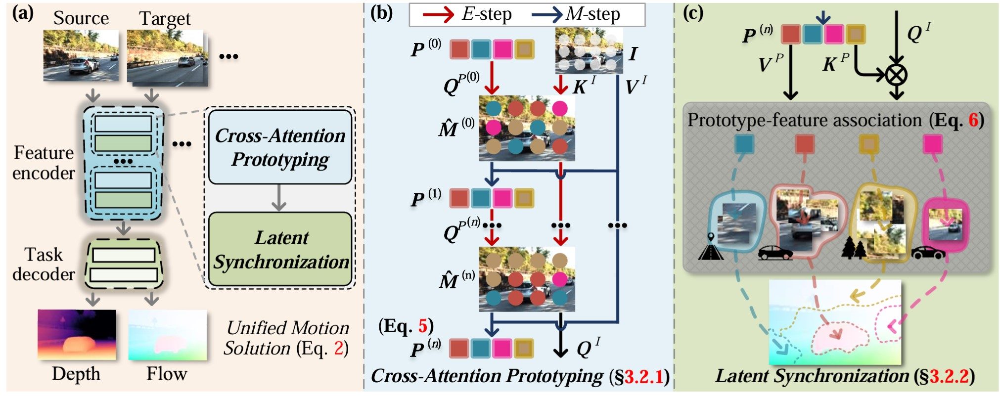
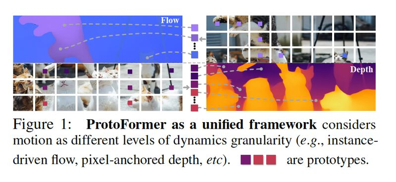

# Prototypical Transformer As Unified Motion Learners (ICML 2024)


> **Abstract:** *In this work, we introduce the Prototypical Transformer (ProtoFormer), a general and unified framework that approaches various motion tasks from a prototype perspective. ProtoFormer seamlessly integrates prototype learning with Transformer by thoughtfully considering motion dynamics, introducing two innovative designs. First, Cross-Attention Prototyping discovers prototypes based on signature motion patterns, providing transparency in understanding motion scenes. Second, Latent Synchronization guides feature representation learning via prototypes, effectively mitigating the problem of motion uncertainty. Empirical results demonstrate that our approach achieves competitive performance on popular motion tasks such as optical flow and scene depth. Furthermore, it exhibits generality across various downstream tasks, including object tracking and video stabilization.*


>
> <p align="center">
>    
>    
> </p>


## Installation

For installation, please create a new environment and follows these steps:

```
pip install torch==1.9.1+cu111 torchaudio==0.9.1 torchvision==0.10.1+cu111 -f https://download.pytorch.org/whl/torch_stable.html
pip install matplotlib
pip install tensorboard
pip install scipy
pip install opencv-python
pip install yacs
pip install loguru
pip install einops
pip install timm==0.4.12
pip install imageio
```

## Dataset preparation

By default `datasets.py` will search for the datasets in these locations. You can use symbolic links for the datasets downloaded in the `datasets` folder.

```Shell
├── datasets
    ├── Sintel
        ├── test
        ├── training
    ├── KITTI
        ├── testing
        ├── training
        ├── devkit
    ├── FlyingChairs_release
        ├── data
    ├── FlyingThings3D
        ├── frames_cleanpass
        ├── frames_finalpass
        ├── optical_flow
    ├── HD1K
        ├── hd1k_input
        ├── hd1k_input
    ├── VKITTI_depth
        ├── vkitti_depth
    ├── KITTI_Eigen
        ├── train
        ├── val
        ├── test   
    ├── MPI-Sintel-depth  
        ├── train   
        ├── test    

```


## Training

To train your own model, please apply the following command. Give on FlyingChair on optical flow as an example.

```
python -u train_ProtoFormer.py  --name chairs --stage chairs --validation chairs
```

More general case:

```
python -u train_ProtoFormer.py  --name DATA_NAME --stage STAGE_NAME --validation VAL_NAME
```

| Dataset | Command | 
|:-----------:|:-----------:|
|Sintel Flow|`python -u train_ProtoFormer.py  --name sintel --stage sintel --validation sintel`|
|Sintel Depth|`python -u train_ProtoFormer.py --name depth_sintel_train --stage depth_sintel --validation depth_sintel --root DATA/MPI-Sintel-depth`|
|KITTI Flow|`python -u train_ProtoFormer.py  --name kitti --stage kitti --validation kitti`| 
|KITTI Depth|`python -u train_ProtoFormer.py --name depth_eigen_train --stage depth_eigen --validation depth_eigen --root DATA/KITTI_Eigen_depth`| 


## Inference

Weights can be downloaded [here](https://drive.google.com/drive/folders/1OwrgMx9DtwOqdlF_ZoIDsBkw1B_zCCQm?usp=drive_link).

```
# Single-gpu infer demo
python infer_depth.py --data_type DATA_NAME
python infer_flow.py  --data_type DATA_NAME
```

## License
ProtoFormer is under the Apache License and is in an active state of update.


## Citation

If you find the work is useful, please cite it as:

```
@inproceedings{han2024prototypical,
  title={Prototypical Transformer As Unified Motion Learners},
  author={Han, Cheng and Lu, Yawen and Sun, Guohao and Liang, James Chenhao and Cao, Zhiwen and Wang, Qifan and Guan, Qiang and Dianat, Sohail and Rao, Raghuveer and Geng, Tong and Tao, Zhiqiang and Liu, Dongfang},
  booktitle={International Conference on Machine Learning},
  year={2024}
}
```


## Acknowledgement

This project is built on the following codes. Great thanks to them!
- [RAFT](https://github.com/princeton-vl/RAFT)
- [GMA](https://github.com/zacjiang/GMA)
- [FlowFormer](https://github.com/drinkingcoder/FlowFormer-Official)
- [R-MSFM](https://github.com/jsczzzk/R-MSFM)
